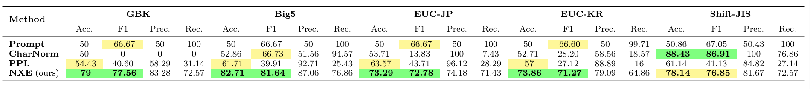
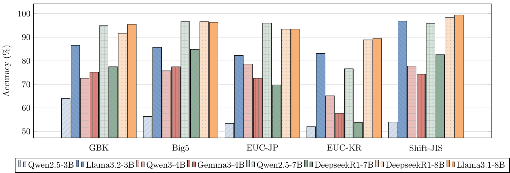
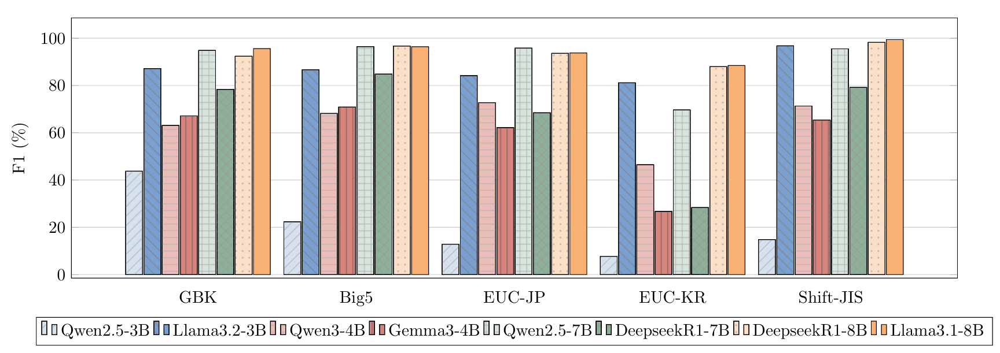

# LGBench

> An encoding oriented semantic validation benchmark.

This repo is mainly used for semantic encoding validation for short CJK texts (SemVal-S). And StruVal-C can be found at [Janus](https://github.com/SWUFE-DB-Group/Janus).

## Dataset Source

All Simplified Chinese data used in LGBench are derived from the [THUOCL](https://github.com/thunlp/THUOCL). The Traditional Chinese, Japanese, and Korean datasets were automatically translated from Simplified Chinese data using GPT-4o, followed by minimal manual verification.

**The Language-Gibberish Dataset Statistics:**

| Encoding      | Positive Samples (`pos`) | Negative Samples (`neg`) |
|---------------|--------------------------|---------------------------|
| **GBK**       | 15,691                   | 51,246                    |
| **Big5**      | 10,200                   | 43,349                    |
| **EUC-KR**    | 15,629                   | 28,632                    |
| **EUC-JP**    | 15,555                   | 32,185                    |
| **Shift-JIS** | 15,538                   | 24,336                    |


## How to Use for Semantic Validation

1. First download a Qwen family model (recommended: [Qwen3-0.6B](https://modelscope.cn/models/Qwen/Qwen3-0.6B) or [Qwen2.5-0.5B](https://modelscope.cn/models/Qwen/Qwen2.5-0.5B) on [ModelScope](https://modelscope.cn/my/overview)):

   ```shell
   modelscope download --model Qwen/Qwen3-0.6B --local_dir ./your_dir
   # or
   modelscope download --model Qwen/Qwen2.5-0.5B --local_dir ./your_dir
   ```
2. Configure the model path: set `model_path` to the **absolute path** of your model directory in `config.json`. 

    ```json
   {"model_path": "C:\\your_path\\qwen2-0.5b"}
   ```
3. Run
   ```shell
   uv run main.py --model <model_name> --bytes <byte_sequence> --enc <encoding>
   
   # --model: qwen2.5 | qwen3
   # --bytes: \x...
   # --enc  : gbk | big5 | euc-kr | euc-jp | shift-jis
   ```
   Each byte must be written as `\x` followed by two hex digits!
   ```shell
   # example
   uv run main.py --model qwen2.5 --bytes "\xcf\xc2\xb5\xa5" --enc gbk
   
   # output:   
   # decode text: 下单
   # SemVal-S result: True
   ```


## How to Run Benchmark Tests on LGBench

```
benches/
├── charset_normalizer/
│   └── run.py
├── nxe/
│   └── run.py
├── ppl/
│   └── run.py
└── prompt/
    └── run.py
```

To run any benchmark test, simply execute the `run.py` script inside its corresponding subdirectory.

> **Note:** `prompt` uses the [Ollama API](https://docs.ollama.com/capabilities/structured-outputs#python) to get stable, structured outputs and control temperature.

## Performance Reports

### Comparison of Different Methods on Various Encodings (%)



### Performance across various SLMs on LGBench

